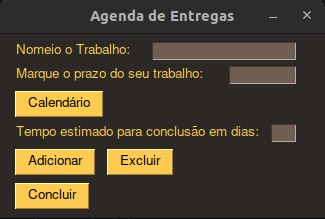
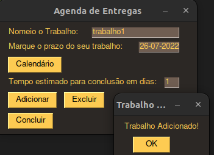
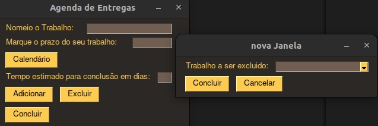
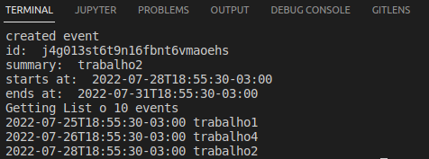
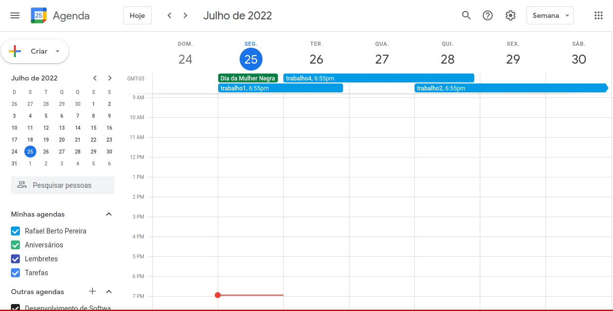

# Greed_AgendaTarefas

**Conteúdo da Disciplina**: Greed<br>

## Alunos
|Matrícula | Aluno 
| -- | -- | 
| 18/0018159  |  Guilherme Veríssimo Cerveira Braz | 
| 18/0108344  |  Rafael Berto Pereira | 

## Sobre 
Usar o algoritimo de "Scheduling to Minimize Lateness", que é um algoritmo ambicioso, para organizar as entregas de trabalho de um estudante. 

O usuário irá registrar as tarefas com o nome, prazo de entrega e tempo estimado de entrega. O algorítimo vai oganizar de maneira ótima a agenda de entregas e irá agendá-las no seu calendário do Google Calendar usando sua API.


## Screenshots
#### Menu de adicionar tarefa

#### Adicionar tarefa

#### Excluir tarefa (antes de adicionar na agenda no google)

#### Log das tarefas adicionadas ja em ordem

#### Calendario com tarefas adicionadas


## Video
- Disponível para download na pasta video

- Disponível no [YouTube](https://youtu.be/c5b0xakpRyA)

## Instalação 
```sh
pip install PySimpleGUI 
```

```sh 
pip install --upgrade google-api-python-client google-auth-httplib2 google-auth-oauthlib 
```

**Linguagem**: Python3 <br>
**Bibliotecas**: 
- PySimpleGUI; 
- google-api-python-client;
- google-auth-httplib2;
- google-auth-oauthlib<br>

**Pre-Requisitos**: Python 3.10.4 <br>

## Uso 
* Logar no email disponível no arquivo credenciais.txt
* python main.py


